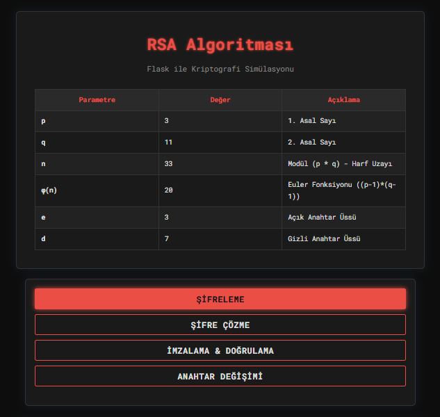
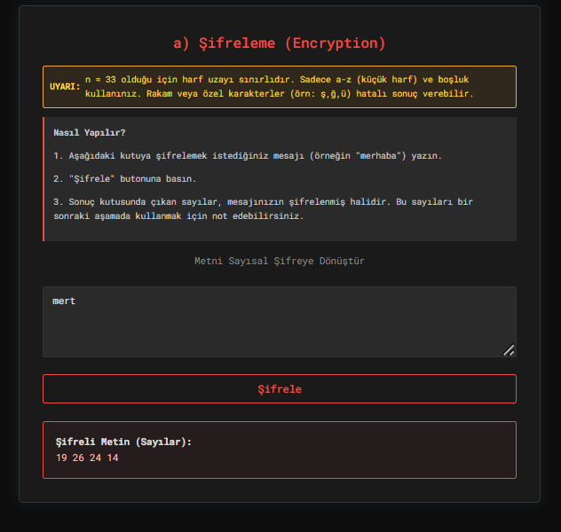
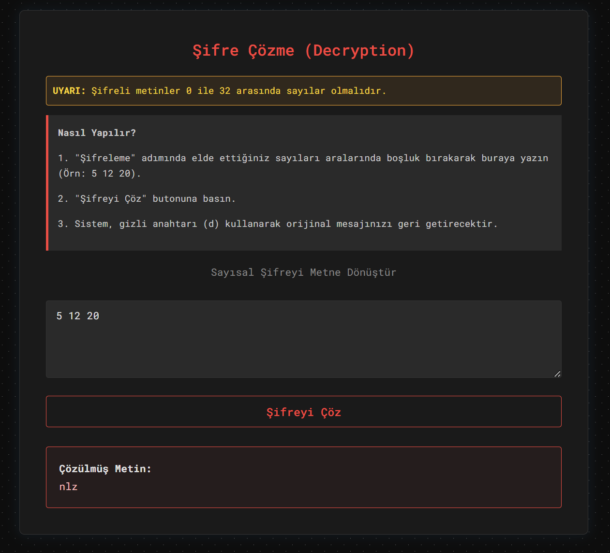
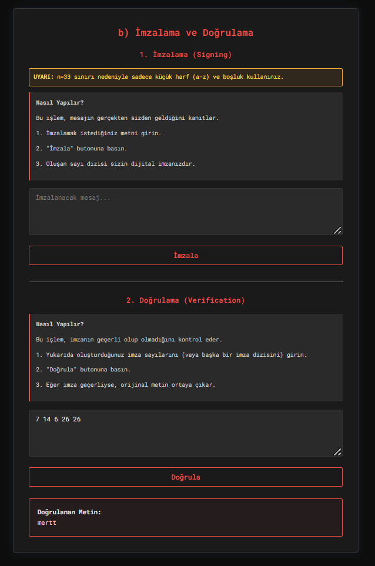
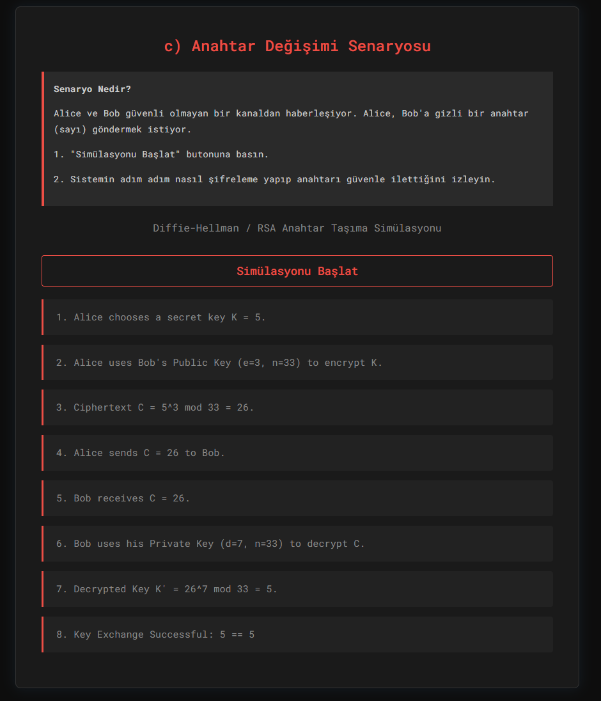

# RSA Flask Application

Bu proje, RSA algoritmasının (p=3, q=11, e=3, d=7) parametreleri ile şifreleme, şifre çözme, imzalama ve anahtar değişimi senaryolarını simüle eden bir Flask uygulamasıdır.

## Kurulum

1. Python yüklü olduğundan emin olun.
2. Gerekli kütüphaneyi yükleyin:
   ```bash
   pip install flask
   ```

## Uygulamayı Çalıştırma

1. Terminali açın ve proje klasörüne gidin.
2. Aşağıdaki komutu çalıştırın:
   ```bash
   python app.py
   ```
3. Tarayıcınızda `http://127.0.0.1:5000` adresine gidin.

## Kullanım ve Ekran Çıktıları

Aşağıda uygulamanın kullanım adımları ve ekran görüntüleri yer almaktadır.

### 1. Ana Sayfa ve Parametreler
Ana sayfada RSA parametreleri (p, q, n, e, d) tablosu görüntülenmektedir.



### 2. Şifreleme (Encryption)
- "Encryption" bölümüne bir metin girin (örneğin: "abc").
- "Encrypt" butonuna basın.
- Şifrelenmiş sayısal değerleri (Ciphertext) not edin.



### 3. Şifre Çözme (Decryption)
- "Decryption" bölümüne, az önce elde ettiğiniz sayıları aralarında boşluk bırakarak girin.
- "Decrypt" butonuna basın.
- Orijinal metnin geri döndüğünü doğrulayın.



### 4. İmzalama (Signing)
- "Signing" bölümüne bir metin girin (örneğin: "imza").
- "Sign" butonuna basın.
- Özel anahtar (d) ile oluşturulan imza değerlerini not edin.



### 5. Doğrulama (Verification)
- "Verification" bölümüne imza değerlerini girin.
- "Verify" butonuna basın.
- İmzalanan metnin açık anahtar (e) ile doğrulandığını görün.

*(Görsel imzalama adımında veya bir sonraki adımda olabilir)*

### 6. Anahtar Değişimi (Key Exchange)
- "Key Exchange Scenario" bölümündeki butona basın.
- Alice ve Bob arasındaki anahtar değişim simülasyonunun adımlarını inceleyin.


